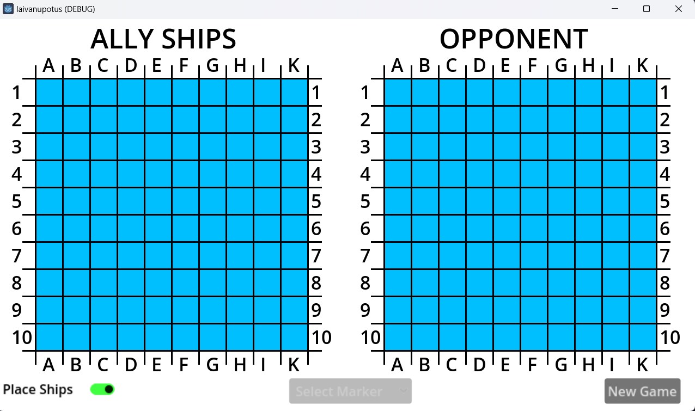
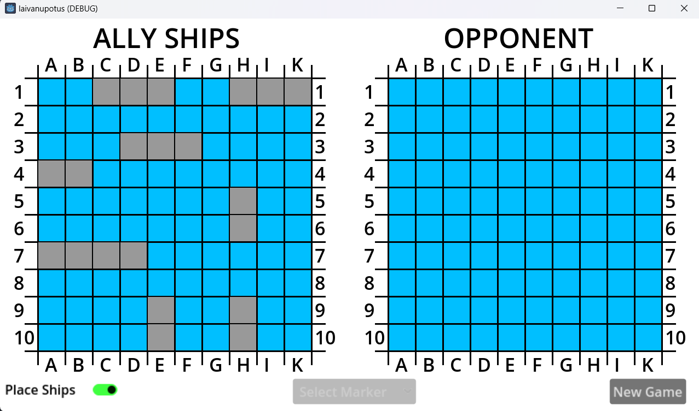
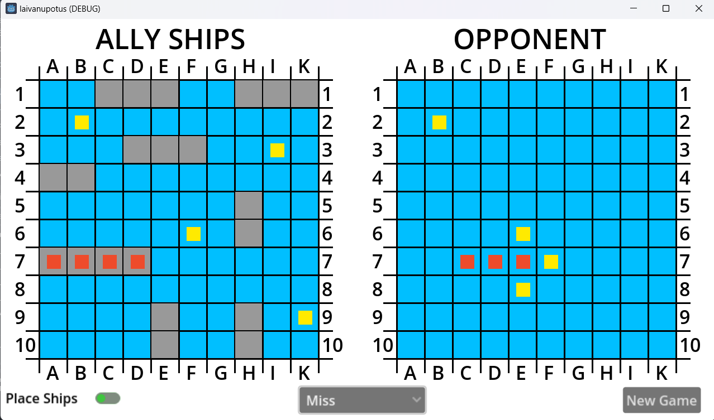
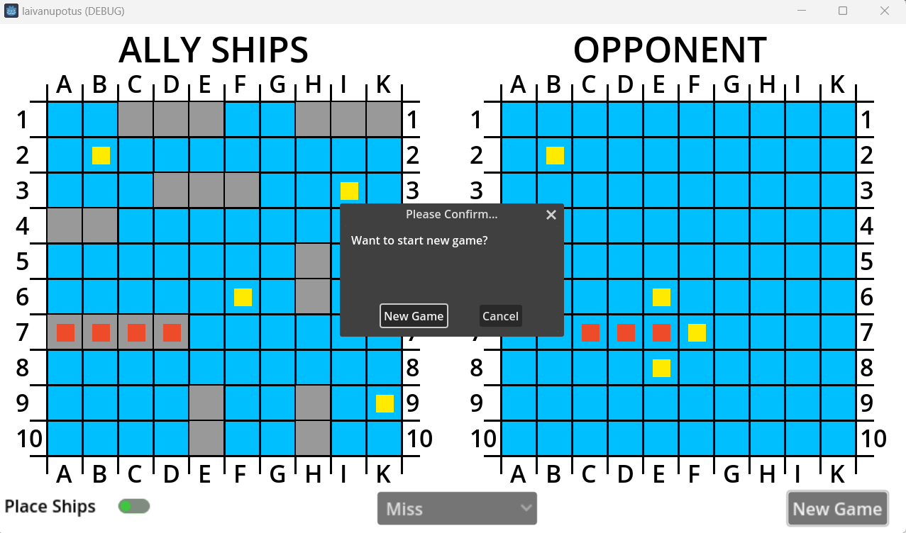

# Battleships android game
Android application built using Godot v4.1.3.
[Wikipedia Battleship](https://en.wikipedia.org/wiki/Battleship_(game))

## Get Started
Install Godot using [godot docs](https://docs.godotengine.org/en/stable/index.html)

## Gameplay
Download andoird version for both users.

### Start new game

### Place Ships

### Place Markers

### End Game

